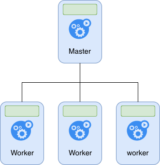
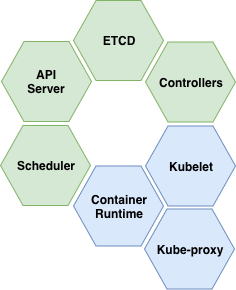
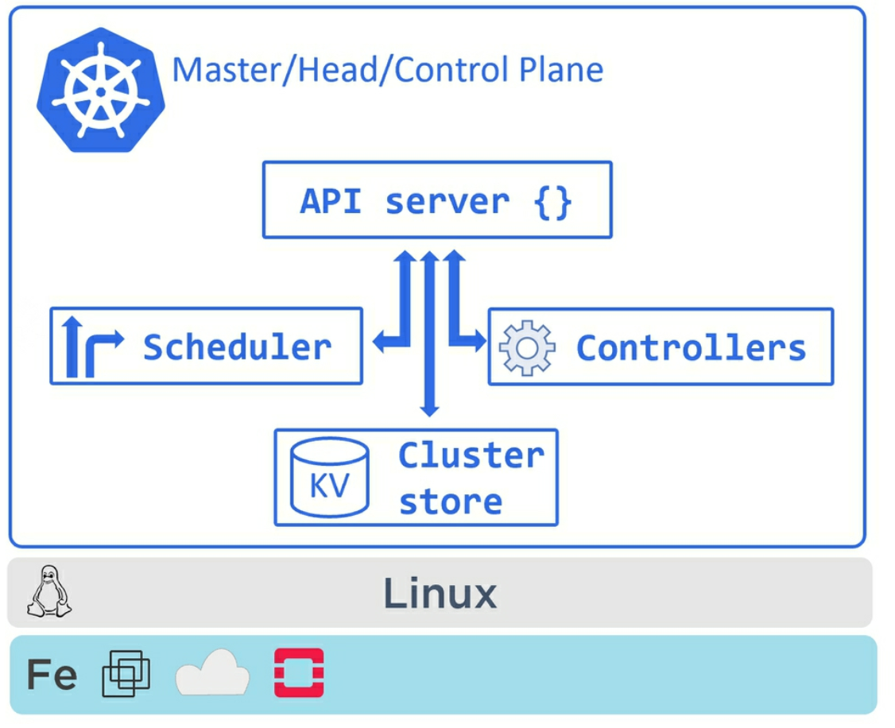
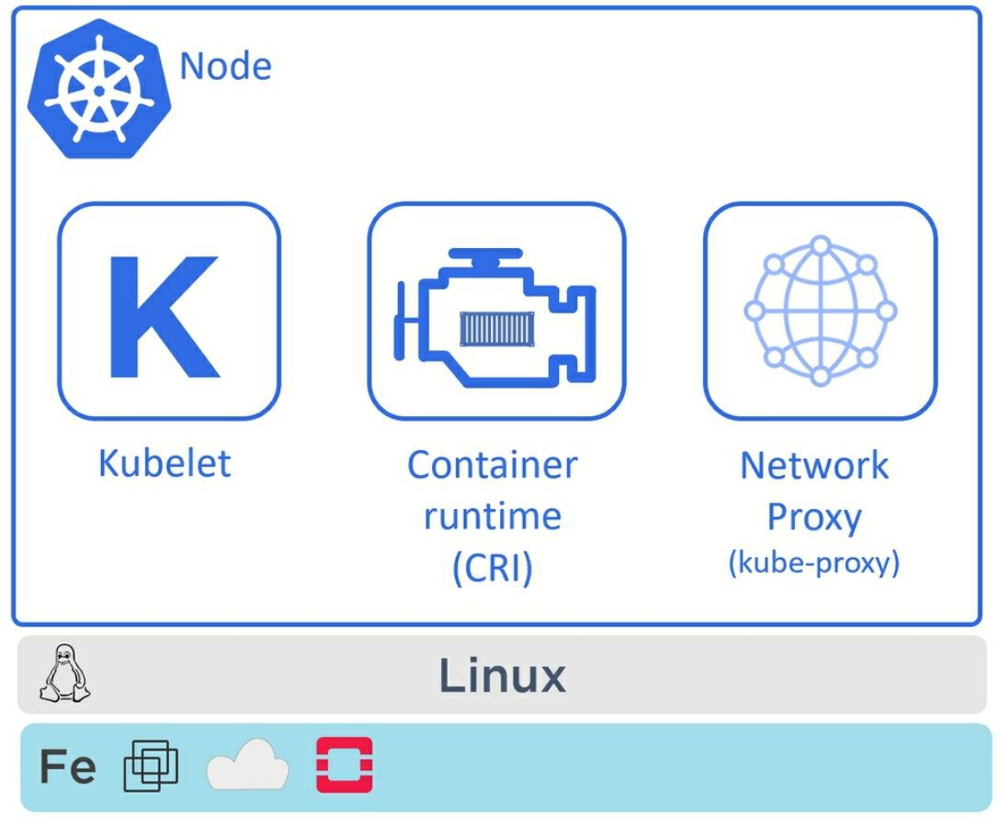
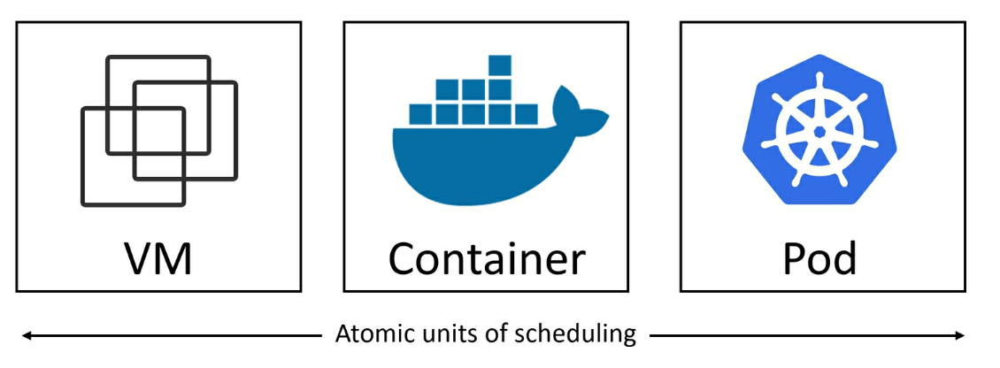
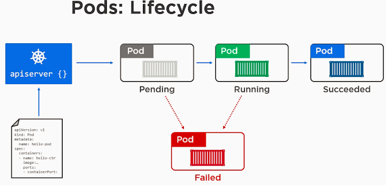
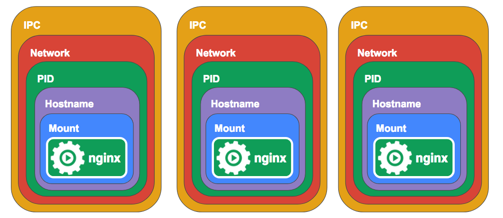
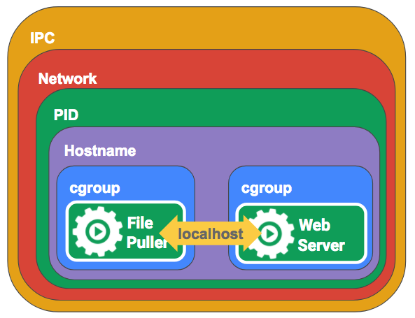
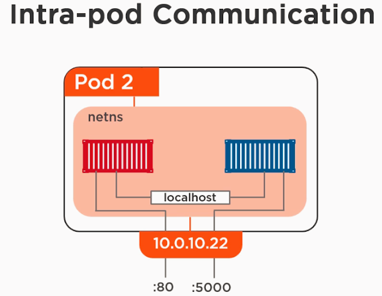
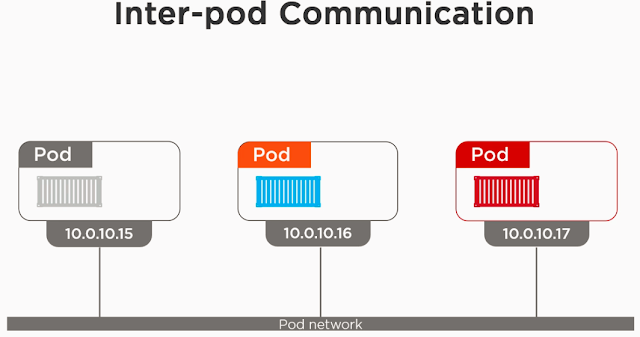

name: splash
layout: true
class: center, middle, inverse

---
count:false
# Kubernetes - Sistema Operacional Distribuido

# by [@famsbh](http://twitter.com/famsbh)

---
layout: true
count:false
name: sessao
class: left, center, inverse
#.logo-linux[]

---
layout: true
name: conteudo
count:false
class: left, top
.logo-linux[]

---
template: splash
# Introdução

---
template: conteudo
# Agenda
- Dia 1
 - Introdução
 - Noções Básicas de Kubernetes
 - Arquitetura K8S
 - Instalação microk8s
 - PODS

- Dia 2
 - Health Checks
 - Labels e Selectors
 - Deployments
 - Services
 - DameonSets
 - Secrets e ConfigMaps

---
# Agenda

- Dia 3
 - Instalando K8s hard way
 - Instalando GKE
 - Namespaces e RBAC
 - Networking
 - Ingress

- Dia 4
  - Security
  - Helm
  - Volumes and data
  - Logging
  - Monitoramento
  - CI/CD
  - Service MESH


---
template: conteudo
# Porque Kubernetes?
- Container é a chave!
  - Portaveis
  - Mais seguros
  - Orientados a applicação
  - Orientados ao desenvolvimento
- Quem gerencia os containers?
  - Você? Scripts? Um sistema próprio?

---
#  O que é Kubernetes?
- Kubernetes é um uma plataforma código aberto para orquestração de container desenvolvida pelo Google.
- É um sistema em cluster de nós distribuídos
- Plataforma centrada em containers
- Plataforma para Micro Serviços
- Plataforma Cloud portável

???
Foto do timão do kubernetes e logo do google

---

# Principios de design
 - Alta disponibilidade
 - Escalabilidade
 - Segurança
 - Portabilidade


---
# Sistema em cluster de nós distribuídos
- O que é cluster computacional?
 - Agrupamento de múltiplos elementos
 - Performance, disponibilidade ou âmbos
- Distribuído
 - Fracamente acoplado
 - Hardware comum
- Orquestração de container? API Declarativa

.half-image-height[]

???

---
# O que Kubernetes NÃO é
- Não é um framework e não limita o tipo de workload
  - Stateless, Statefull, data-processing

- Não compila ou gerencia código fonte. Mas fornece facilidades para o CI/CD

- Não provê serviços no nível de aplicação.
  - Messageria
  - Banco de dados
  - processamento de dados distribuídos

---
# O que Kubernetes NÃO é
- Não define padrão de logging, monitoramento ou alertas
 - Mas provê integrações e mecanismos para exportar métricas

- Não define linguagem de configuração. Provê uma API delcarativa extensível

- Não adota nenhum sistema de configuração de hardware, manutenção, gerenciamento ou resiliência para equipamentos

???
 - Embora seja mais comum os stateless e deve-se pensar bem antes de usar o statefull
 - API + ambiente para execução
 - Diferente de outros sistemas em cluster com foco em fazer com que a aplicação seja vista como única, o kubernetes É uma plicação em cluster
 - Existem boas práticas e vários projetos concorrentes. (prometheus)
 - Pensando como orquestraçã, A depois B depois C
 - Agnóstico de startup

---
template: splash
# Arquitetura

---
template: conteudo
# Componentes K8S

.half-image[]

---
# API Server (control panel)
- Componente central do K8S
- Todas as compunicações internas e externas (Sem api escondida)
- RESTFull
- YAML manifests
- SSL, AAA

---
# ETCD Cluster Store  (control panel)
- Base chave/valor distribuída
- Consistência sobre Disponibilidade
- RAFT Consensus
- Em caso de split não há parada dos workers

---
# Controller Manager (control panel)
- Controller dos Controllers

- Watch loop
  - Node controller
  - replicaset
  - endpoint
  - ...

- Desired State


---
# Scheduler (control panel)
- Agenda Tarefas para os Worker Nodes

- Define o node a executar em um mixto de restrições e pesos. (Black Magic)

- Não executa o pod, só define o node

- Em caso de não existir um node disponível, pod ficará em pending

---
# Cloud Controller manager
- Interage com o provedor de cloud suportado
- Instances
- load balancer
- storage

---
# Control Panel
.half-image[]

---
# Kubelet (Worker)
- Reporta o estado de recursos para o cluster

- Verifica o que precisa ser executado

- Reporta falhas e estatísticas para a api

---
# Container Runtime Interface CRI (worker)
- Gerencia os containers

- Download de imagem

- Executa, para, canal de comunicação

- Varios plugins
  - Docker
  - rkt
  - containerd

---
# Other
- kube-proxy
  - Local Network
  - Services Network
  - Load Balance (ipvs, iptables)

- Kube-DNS
  - CoreDNS from CoreOS
  - Registro de serviços

---
# Worker Node

.half-image[]

---
# PODS
- Unidade minima de execução
- Executa containers
- Entregue via manifest
- Não são escaláveis, não são resilientes



---
# POD Manifest
```yaml
apiVersion: v1
kind: Pod
metadata:
  name: nginx
  labels:
    ambiente: curso
    name: nginx
spec:
  containers:
  - name: nginx
    image: nginx
    ports:
    - containerPort: 80
```
### Executando pod
```bash
kubectl create -f nginx.yaml
kubectl get pods -o wide
kubectl port-forward nginx 8080:80
```

---
# YAML Manifest
- apiVersion
- kind
- metadata
- spec

---
# YAML apiGroup/Version
- Grupo de apis/versão
- PODs estão no _CORE_
- v1, v1beta1
- Exemplos
  - storage.k8s.io/v1
  - rbac.authorization.k8s.io/v1
  - apps/v1

---
# Yaml kind
- Tipo de objeto
- Depende do api group
- Ex:
  - Deployment
  - Pod
  - Secret
  - Role
  - RoleBinding

---
# YAML Metadata
- Nomes e Labels
- Identificação
- Seleção
- Namespaces

---
# YAML spec (POD)
 - containers
  - nome
  - volumes
  - resources (cgroups)
  - command
  - ...
 - Volumes


---
# POD Ciclo de vida
.full-image[]

---
# POD Namespaces
.full-image[]

---
# POD Namespaces
.half-image[]

---
# Comunicação intra-pod
.half-image[]

---
# Comunicação inter-pods
.full-image[]

---
# POD Pause container
- Namespace holding
- PID 1
- Zombies

---
# Kubectl pods
- listar pods
```bash
kubectl get pods -o wide
NAME                    READY   STATUS    RESTARTS   AGE   IP           NODE       NOMINATED NODE
nginx-dbddb74b8-7wzbs   1/1     Running   0          16m   10.200.0.7   worker-0   <none>
```
- ver configuracao
```bash
kubectl get pods -o yaml
apiVersion: v1
kind: Pod
metadata:
  creationTimestamp: 2019-05-03T15:42:07Z
  labels:
    name: nginx
  name: nginx
...
spec:
  containers:
  - image: nginx
  ...
    volumeMounts:
    - mountPath: /var/run/secrets/kubernetes.io/serviceaccount
      name: default-token-knphf
      readOnly: true
```

---
# kubectl pods
- editar

```bash
kubectl edit pod nginx
```
- history

```bash
kubectl describe pod nginx
Name:               nginx
Namespace:          prd
Priority:           0
PriorityClassName:  <none>
Node:               worker-0/10.240.0.20
Start Time:         Fri, 03 May 2019 12:42:07 -0300
Labels:             name=nginx
Annotations:        <none>
Status:             Running
IP:                 10.200.0.8
...
Events:
  Type    Reason     Age    From               Message
  ----    ------     ----   ----               -------
  Normal  Scheduled  3m14s  default-scheduler  Successfully assigned prd/nginx to worker-0
  Normal  Pulling    3m11s  kubelet, worker-0  pulling image "nginx"
  Normal  Pulled     3m11s  kubelet, worker-0  Successfully pulled image "nginx"
  Normal  Created    3m11s  kubelet, worker-0  Created container
  Normal  Started    3m11s  kubelet, worker-0  Started container
```

---
# Pods kubectl

```bash
kubectl exec -it nginx -- bash

kubectl logs nginx
 * Serving Flask app "app" (lazy loading)
 * Environment: production
   WARNING: Do not use the development server in a production environment.
   Use a production WSGI server instead.
 * Debug mode: on
 * Running on http://0.0.0.0:5000/ (Press CTRL+C to quit)
 * Restarting with stat
 * Debugger is active!
 * Debugger PIN: 211-575-116
 ...

kubectl delete pod nginx
```

---
# Health chekcs
- Saude do POD
- Importante para o deployment
- liveness probe
- readiness probe
- Probes
  - http
  - command
  - tcp

---
# Liveness
.half-image[]

---
# Liveness command
```yaml
apiVersion: v1
kind: Pod
metadata:
  labels:
    test: liveness
  name: liveness-exec
spec:
  containers:
  - name: liveness
    image: k8s.gcr.io/busybox
    args:
    - /bin/sh
    - -c
    - touch /tmp/healthy; sleep 30; rm -rf /tmp/healthy; sleep 600
    livenessProbe:
      exec:
        command:
        - cat
        - /tmp/healthy
      initialDelaySeconds: 5
      periodSeconds: 5
```

---
# Liveness http
```yaml
apiVersion: v1
kind: Pod
metadata:
  labels:
    test: liveness
  name: liveness-http
spec:
  containers:
  - name: liveness
    image: k8s.gcr.io/liveness
    args:
    - /server
    livenessProbe:
      httpGet:
        path: /healthz
        port: 8080
        httpHeaders:
        - name: Custom-Header
          value: Awesome
      initialDelaySeconds: 3
      periodSeconds: 3
```

---
# Liveness TCP
```yaml
apiVersion: v1
kind: Pod
metadata:
  name: goproxy
  labels:
    app: goproxy
spec:
  containers:
  - name: goproxy
    image: k8s.gcr.io/goproxy:0.1
    ports:
    - containerPort: 8080
    readinessProbe:
      tcpSocket:
        port: 8080
      initialDelaySeconds: 5
      periodSeconds: 10
    livenessProbe:
      tcpSocket:
        port: 8080
      initialDelaySeconds: 15
      periodSeconds: 20
```

---
# Readiness probe
 - initialDelaySeconds
 - periodSeconds
 - timeoutSeconds
 - successThreshold
 - failureThreshold

---
# Readiness
.half-image[]

---
# Readiness yaml
```yaml
readinessProbe:
  exec:
    command:
    - cat
    - /tmp/healthy
  initialDelaySeconds: 5
  periodSeconds: 5
```

